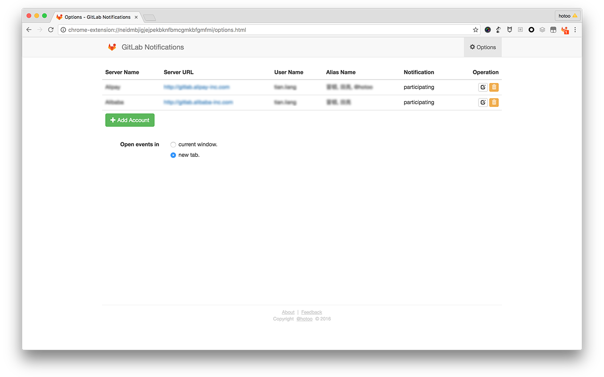
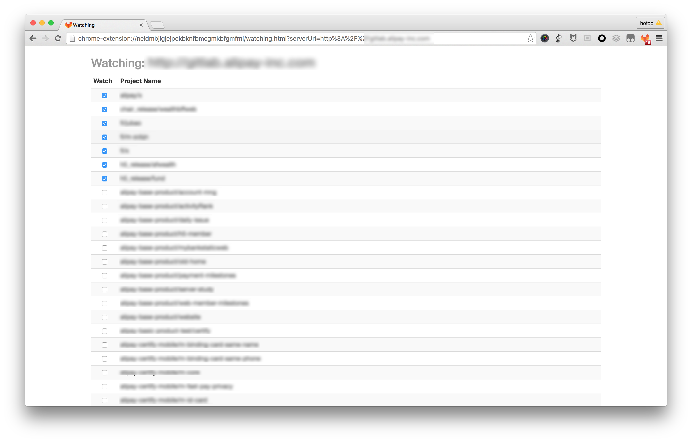

#  GitLab Notifications

GitLab Notifications is a Google Chrome Extensions tools like GitHub Notifications.

## Usage

1. [Installation](https://chrome.google.com/webstore/detail/gitlab-notifications/neidmbjigjejpekbknfbmcgmkbfgmfmi)
1. GitLab Notifications -> Options:
  - `Server URL` is GitLab server url, like `https://gitlab.com`
  - `Private Token` is a secret key, from like `https://gitlab.com/profile/account`
  - `User Name` is you GitLab account username, like me is `hotoo`
  - `Alias Name`: what people called you? luck names. when people called you in issue, merge request, or note(comment),
    you will be participating this event. multiple alias name separate by comma(`,`).
  - `Notification`: choose the type for pop-window notification.

  

1. `Save`, and `Watching Repositories`:
  - Please wait a moment to get all of git repositories you have rights.
  - Checked what repositories you want to watching.

  

1. Done. you just need quiet and waiting for notifications.

## Features

- No emails, just do it in a browser, You need not switch App between Mail and Browser.
- Simple and fast.
- Group by Issue or MergeRequest key, no duplicate events.
- Direct go to the last un-read position.
- Auto mark readed Issue and MergeRequest as read.
- Immediately notify when someone assignee or mention to you (or you alias name).
- Need not watching the immediately notification, you can get all of events
  (include participating events) at anytime.

## Feedback

- [Find or New issue](https://github.com/hotoo/gitlab-notifications/issues)
