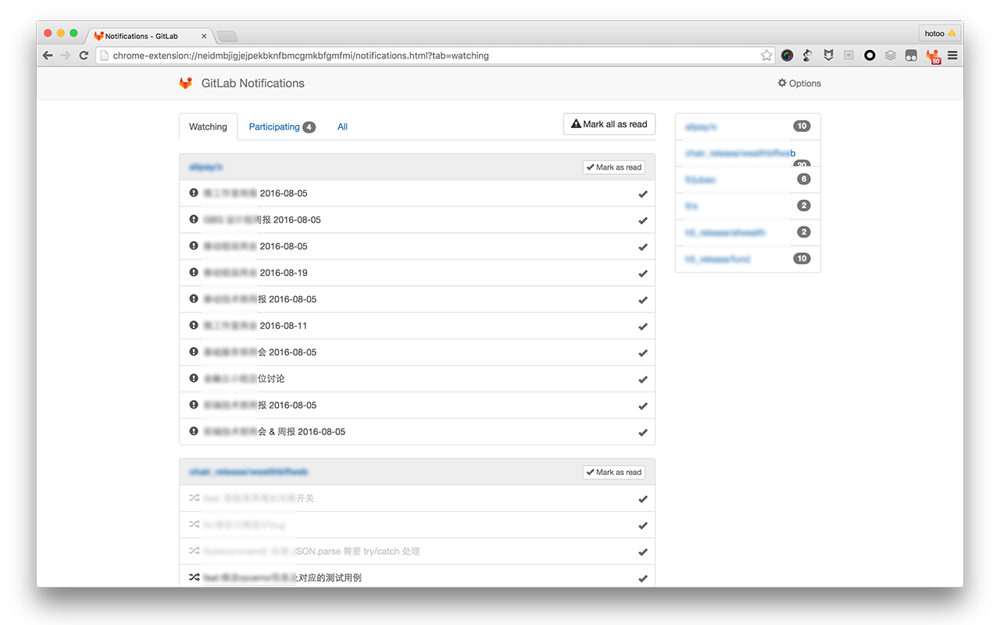

# GitLab Notifications

GitLab Notifications is a Google Chrome Extensions tools like GitHub Notifications.

## Usage

1. [Installation](https://chrome.google.com/webstore/detail/gitlab-notifications/neidmbjigjejpekbknfbmcgmkbfgmfmi)
1. GitLab Notifications -> Options:
  - `Server URL` is GitLab server url, like `https://gitlab.com`
  - `Private Token` is a secret key, from like `https://gitlab.com/profile/account`
  - `User Name` is you GitLab account username, like me is `hotoo`
  - `Alias Name`: what people called you? luck names.
  - `Notification`: choose the type for pop window notification.
1. `Save`, and `Watching Repositories`:
  - Please wait a moment to get all of git repositories you have rights.
  - Checked what repositories you want to watching.
1. Done. you just need quiet and wait for notifacitons.
