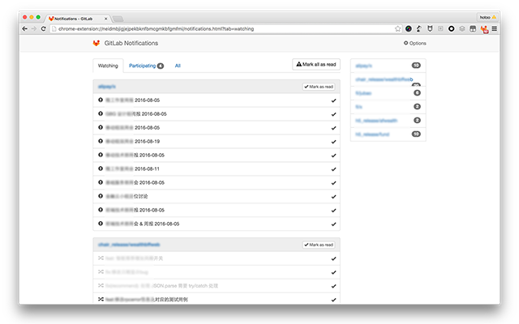

#  GitLab Notifications

GitLab Notifications is a Google Chrome Extensions tools like GitHub Notifications.

## Usage

1. [Installation](https://chrome.google.com/webstore/detail/gitlab-notifications/neidmbjigjejpekbknfbmcgmkbfgmfmi)
1. GitLab Notifications -> Options:
  - `Server URL` is GitLab server url, like `https://gitlab.com`
  - `Private Token` is a secret key, from like `https://gitlab.com/profile/account`
  - `User Name` is you GitLab account username, like me is `hotoo`
  - `Alias Name`: what people called you? luck names. when people called you in issue, merge request, or note(comment),
    you will be participating this event. multiple alias name separate by comma(`,`).
  - `Notification`: choose the type for browser pop-window notification.

  

1. `Save`, and `Watching Repositories`:
  - Please wait a moment to get all of git repositories you have rights.
  - Checked what repositories you want to watching.

  

1. Done. you just need quiet and waiting for notifications.

## Features

- No emails, everything in one browser, You needn't switch Applications between Mail and Browser.
- Simply and fastly.
- Multiple GitLab accounts.
- Group by Issue or MergeRequest unique key, no duplicate events.
- Direct go to the start position where your unread.
- Auto mark Issue and MergeRequest events as read when you read it.
- Immediately notify you when someone assignee or mention to you (or you alias name).
- You needn't watching the immediately notification, you can get all of events
  (include participating events) at anytime.

## How does it works?

This extension worked base on GitLab API(v3).

GitLab API events api just support one project events, if you watching too much
projects, this extension will be send much more request to get all projects
events what you watching. is sad, but I will be care about this.

## Feedback

- [User voice](./user-voice.md)
- [Find or New issue](https://github.com/hotoo/gitlab-notifications/issues)
