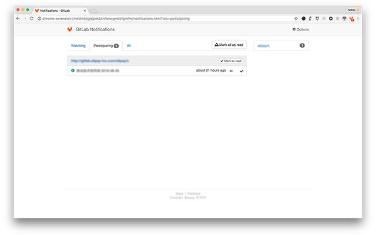
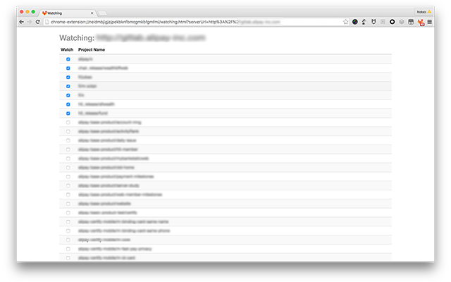
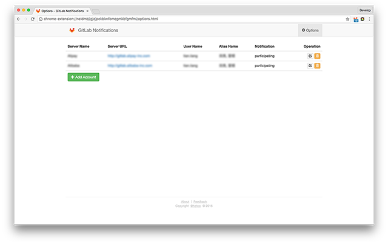
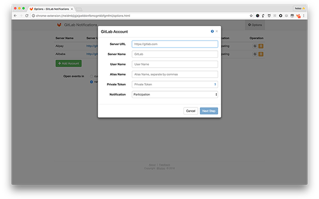
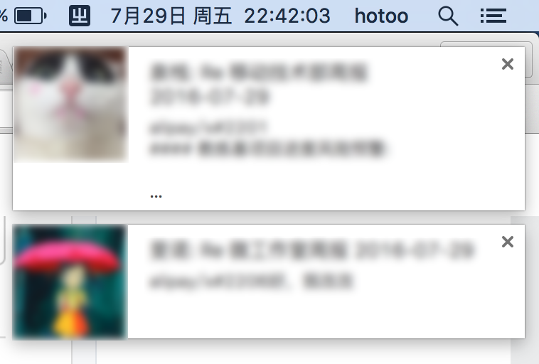
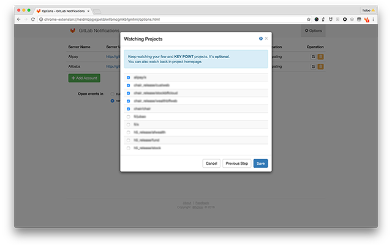
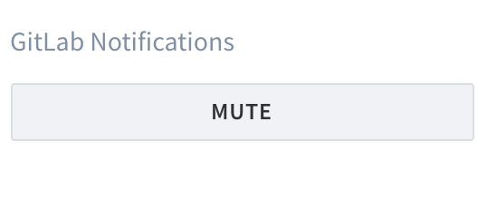

#  GitLab Notifications

GitLab Notifications is a Google Chrome Extensions tool like GitHub Notifications.

## Features

- No emails, everything in one browser, You need't switch Applications between Mail and Browser.
- Simply and fastly.
- Multiple GitLab accounts.
- Group by Issue or MergeRequest unique key, no duplicate events.
- Direct go to the start position where your unread.
- Auto mark Issue and MergeRequest events as read when you read it.
- Immediately notify you when someone assignee or mention to you (or your alias name).
- You need't watching the immediately notification, you can get all of events
  (include participating events) at anytime.

## Installation

[Install on Chrome Web Store](https://chrome.google.com/webstore/detail/gitlab-notifications/neidmbjigjejpekbknfbmcgmkbfgmfmi)

## Configuration

1. GitLab Notifications -> Options:

    

1. Add Account:

    

    - `Server URL` is GitLab server url, like `https://gitlab.com`
    - `Server Name`: named your GitLab account for display.
    - `Private Token` is a secret key, from like `https://gitlab.com/profile/account`
    - `User Name` is your GitLab account username, like me is `hotoo`
    - `Alias Name`: what people called you? luck names. when people called you in issue, merge request, or note(comment),
    you will be participating this event. multiple alias name separate by comma(`,`).
    - `Notification`: choose the type for browser pop-window notification.
        - `Watching`: All of your watching projects events (Issues, Merge Requests, Comments) will popup notification you.
        - `Participating`: All of your participating events will popup notification you.
        - `Disable`: Disable popup notification.

        

1. Next Step and watching projects:

    

1. `Save`, Done. you just quiet and waiting for notifications.

## Badge

 You have participating events, click badge icon goto the participationg event list.

 You have watching events, click badge icon goto the watching event list.

 You have other unread events, click badge icon goto all event list.

 You have no unread event.

## Event Status

 Issue is opened.

 Issue is closed.

 Unknow issue status.

 Merge Request is opened.

 Merge Request is accepted.

 Merge Request is closed.

 Unknow merge request status.

## Mark as read

1. In GitLab Notifications center, you can manually mark notifications as read.
2. In GitLab website, automatically mark notifications as read when you read a issue or merge request.

## Mark as mute

1. In GitLab Notifications center, you can mark notifications as mute.
2. In GitLab website, you can toggle notifications as mute or unmute.

## How does it works?

This extension worked base on GitLab API(v3).

## Bad news

- This extension just support Google Chrome web browser now.
- Your notifications data store on your web browser. When you use multiple browser profiles or different devices,
  and the profiles or devices use the same GitLab accounts, you will be get duplicate notifications.

## Support this extension

- [Star this repository](https://github.com/hotoo/gitlab-notifications)
- [Review on Chrome Web Store](https://chrome.google.com/webstore/detail/gitlab-notifications/neidmbjigjejpekbknfbmcgmkbfgmfmi/reviews)

## Feedback

- [User voice](./user-voice.md)
- [Find or New issue](https://github.com/hotoo/gitlab-notifications/issues)
